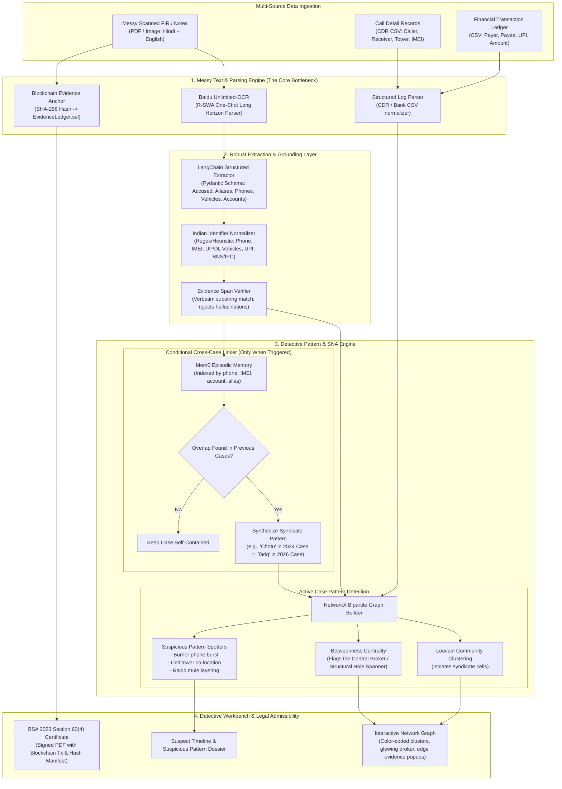

# NyayaGraph-GN: AI-Powered Detective & Criminal Network Analysis System
## SIH26189 Prototype Architecture Plan — Ministry of Home Affairs, Blockchain & Cybersecurity
**Target Environment: Single Laptop Prototype (16 GB RAM / Standard CPU / Optional GPU)**  
**Core Purpose: Solve the messy text entity extraction bottleneck, detect suspicious patterns in active cases, cross-reference past cases conditionally for pattern expansion, and pinpoint the central broker.**

---

## 1. Problem Statement Alignment & The "Winning the Room" Strategy

### 1.1 The Core Problem (SIH26189)
Law enforcement investigators are overwhelmed by fragmented, messy data:
- **Unstructured:** Scanned Hindi/English handwritten FIRs, interrogation transcripts, daily dairy entries (GDs), and surveillance notes.
- **Structured:** Call Detail Records (CDRs) with cell tower IDs, bank account/UPI ledgers, and vehicle registration databases.

Manual analysis takes days, misses hidden links, and fails to establish court-admissible evidentiary chains.

### 1.2 The SIH Reviewer Insight & Our Core Differentiator
> *"The link-analysis concept is valuable and demos well, but commercial tools already exist — make **robust entity extraction from messy text your real contribution**, since that is the actual bottleneck."*

Commercial tools (like i2 Analyst's Notebook or Palantir) require clean, pre-structured inputs. NyayaGraph's true breakthrough is:
1. **End-to-End Messy Document Parsing**: Baidu **Unlimited-OCR** extracts dense, low-quality, multi-page scanned FIRs without memory crashes or hallucination.
2. **Robust Entity & Identifier Normalization**: Handles Indian police dialect, Hinglish, informal aliases, 10-digit mobile numbers, 15-digit IMEIs, Indian vehicle numbers (`UP16-XX-XXXX`), UPI IDs, and bank account numbers.
3. **Closed-World Evidence Grounding**: Every node and edge is hard-verified against exact character spans in the raw source document.

### 1.3 "The Smallest Thing That Wins the Room" (Hackathon Demo Target)
In 3 minutes, the demo executes:
1. **Ingest a messy, real-world mock FIR + CDR CSV** in under 10 seconds.
2. **Robustly extract people, burner numbers, locations, and bank accounts** from the messy text.
3. **Build the relationship graph** merging unstructured FIR mentions with structured CDR call frequencies and fund flows.
4. **Spotlight the Central Individual (Structural Hole Spanner)** connecting two otherwise disconnected clusters (e.g. Call Center Scam Cell $\leftrightarrow$ Bank Mule Ring via a Hawala/SIM broker).
5. **Trigger Conditional Cross-Case Pattern Match**: Surface a past resolved case *only because* the broker's phone number previously appeared in a 2024 extortion case.
6. **Export BSA 2023 Section 63(4) Blockchain Certificate**: Display the immutable transaction hash and court-ready admissibility report.

---

## 2. System Architecture Diagram

---

## 3. Detailed Component Breakdown

### 3.1 Messy Text Extraction Engine (Solving the Real Bottleneck)

Indian FIRs combine typed Hindi headers, handwritten narrative sections in vernacular dialects (Western UP, Khariboli, Hinglish), and messy seizure lists (Fard Baramadgi).

1. **Baidu Unlimited-OCR (Long-Horizon One-Shot Parser)**:
   - Uses **Reference Sliding Window Attention (R-SWA)** to parse entire 15–20 page case files in one forward pass.
   - Eliminates KV cache blowups and maintains reading order across multi-column police forms.
   - Preserves coordinates and bounding boxes for verbatim source highlighting.

2. **Indian Law Enforcement Identifier Normalizer**:
   - **Phone Numbers:** Normalizes `+91`, `0`, spaces, and dashes into canonical 10-digit formats; flags virtual VoIP numbers (+1, +44).
   - **IMEIs:** Identifies and validates 15-digit TAC numbers.
   - **Vehicle Plates:** Recognizes standard state formats (`UP16 AB 1234`, `DL 3C AF 9876`).
   - **Aliases / 'Urf':** Extracts Indian alias structures: `"Mohd. Tariq @ Chotu"`, `"Radhey urf Rahul"`.
   - **Legal Sections:** Normalizes Bharatiya Nyaya Sanhita (BNS) 2023 and Indian Penal Code (IPC) references (`BNS 318(4)` $\leftrightarrow$ `IPC 420` cheating).

3. **Closed-World Verifier**:
   - No entity exists in the graph unless its text span appears verbatim (or $\ge 97\%$ fuzzy match for OCR noise) in the source document.
   - Any hallucinated entity from the LLM is intercepted and flagged `needs_review: extraction_unverified`.

---

### 3.2 In-Case Suspicious Pattern Detection

Before looking at historical data, the system analyzes the **active case** for suspicious tradecraft:

| Pattern | Detection Logic | Law Enforcement Significance |
|---|---|---|
| **1. Central Broker (Structural Hole Spanner)** | Node with highest **Betweenness Centrality** bridging two low-density clusters. | Pinpoints the hawala banker, SIM supplier, or corrupt middleman connecting the scam call center with cash-out mules. |
| **2. Burner Phone / Burst Activity** | A phone active for $< 72$ hours with high call volume to 10+ numbers immediately before/after an incident timestamp. | Operational burner SIM used during crime execution. |
| **3. Cell Tower Co-Presence** | CDR log showing suspect SIM and victim SIM/device pinging the same Cell Tower ID within a 15-minute window. | Directly proves physical presence at the scene of crime. |
| **4. Rapid Fund Layering** | Account A receives ₹10L $\rightarrow$ transfers to 4 accounts in $< 30$ mins $\rightarrow$ immediate ATM/crypto cash-out. | Cyber fraud money mule layering chain. |

---

### 3.3 Conditional Cross-Case Pattern Discovery

> **Guiding Principle:** Historical cases are referenced **only when they help establish or complete a pattern**. The system never bloats the active graph with irrelevant past records.

1. **Trigger Conditions:**
   - **Exact Identifier Collision:** A phone number, IMEI, UPI ID, vehicle plate, or bank account in the current FIR exists in a previous case.
   - **High-Confidence Alias Collision:** Suspect name + father's name or alias match with $> 90\%$ Jaro-Winkler similarity.
   - **Modus Operandi Signature Match:** Current crime follows an identical 3-step scam pattern (e.g. "Fake Customs parcel $\rightarrow$ Skype digital arrest $\rightarrow$ RTGS transfer to Federal Bank mule account").

2. **Action Upon Trigger:**
   - **Do NOT merge entire previous case.**
   - **Only project the linking bridge:** The past suspect node is brought into view as a **ghost node (dotted border)** with a badge: *"Prior Offender: FIR 45/2024 PS Surajpur (Bail Active)"*.
   - Flags syndicate hierarchy: *"Accused Tariq operates under Kingpin Vikram (wanted in 3 GBN cyber cases)."*

---

### 3.4 Interactive Network Graph & Detective Workspace

Built with **NetworkX** (backend analytics) + **Cytoscape.js / Pyvis** (interactive UI):

- **Visual Cluster Coloring:**
  - 🔴 **Red Cluster:** Call Center Scam Callers / Impersonators
  - 🔵 **Blue Cluster:** Bank Account Mules / Cash Out Nodes
  - 🟢 **Green Nodes:** Identified Victims & Complainants
  - 🟡 **Glowing Gold Star:** **The Central Broker / Hawala Operator** (Highest Betweenness Centrality)
- **Click-to-Evidence Inspection:**
  - Clicking any node displays the suspect dossier and all associated phones/accounts.
  - Clicking any edge displays the exact raw FIR excerpt or CDR call timestamp that created that link.

---

### 3.5 Blockchain Evidence Ledger (BSA 2023 Section 63 Admissibility)

To ensure the analysis is admissible in an Indian court under **Section 63 of Bharatiya Sakshya Adhiniyam, 2023**:

1. **At Ingestion:**
   - Compute SHA-256 hash of raw FIR PDF and CDR CSV.
   - Log transaction to `EvidenceLedger.sol` smart contract (on local EVM testnet or Python sovereign ledger):
     - `docHash`: SHA-256 of file
     - `caseId`: e.g. "FIR-GBN-1234-2026"
     - `officerId`: Badge ID of Investigating Officer
     - `timestamp`: Block time
2. **At Export:**
   - System compiles the graph snapshot, central broker analysis, and evidence links into a court brief.
   - Generates the **Section 63(4) Certificate** carrying:
     - Digital signature of the nodal officer.
     - Blockchain transaction receipt hash.
     - Complete SHA-256 hash manifest of all source documents.

---

## 4. Single-Laptop Technical Stack

| Layer | Component | Single-Laptop Implementation | Memory / Resource Footprint |
|---|---|---|---|
| **OCR & Layout** | Messy Document Ingestion | **Baidu Unlimited-OCR** (`transformers` / CPU or GPU) | ~1.5 GB VRAM / 2.5 GB RAM with R-SWA |
| **Pipeline & Agents** | Orchestration & NLP | **LangChain** + Pydantic Schema Decoding | Minimal (~200 MB RAM) |
| **LLM Inference** | Entity Extraction & Insights | **Ollama** (`qwen2.5:7b` or `llama3.2:3b`) OR Cloud API toggle (Groq/Gemini) | 4-5 GB RAM (Local) / Zero RAM (API toggle) |
| **Cross-Case Memory** | Conditional Pattern Search | **Mem0** (ChromaDB embedded backend) | File-based in `data/chroma_db` (~100 MB) |
| **Graph Analytics** | Network Science & Centrality | **NetworkX + python-louvain** | Pure in-memory Python (< 50 MB for 10,000 nodes) |
| **Blockchain Ledger** | BSA 2023 Sec 63 Chain-of-Custody | **Web3.py (Local EVM) + Sovereign Python Ledger** | Instant execution, zero container overhead |
| **Database & Cache** | Case Store & Audit Logs | **SQLite** (`data/nyayagraph.db`) | Zero background service |
| **Detective UI** | Web Dashboard & Visual Graph | **Streamlit / Vite React with Cytoscape.js** | Instant hot-reload, interactive canvas |
